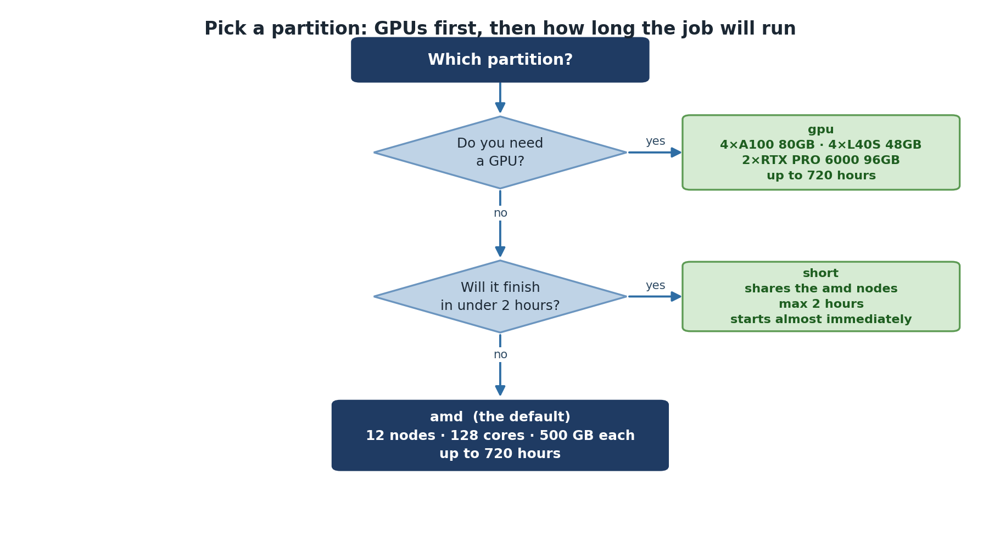

:::::::::::::::::::::::::::::::::::::: questions

- What partitions are available on Sagehen HPC?
- How do I choose the right partition for my job?
- What GPU types are available?

::::::::::::::::::::::::::::::::::::::::::::::

::::::::::::::::::::::::::::::::::::: objectives

- Understand the characteristics and use cases for each Sagehen partition
- Match job requirements to the appropriate partition
- Know the available GPU types and their strengths

:::::::::::::::::::::::::::::::::::::::::::::::

## The "amd" Partition (General Compute)

The workhorse of Sagehen, suitable for most research computing.

For the current node count, CPU count, and RAM configuration, run `sinfo -p amd` on Sagehen.

| Property | Value |
|----------|-------|
| Configuration | See `sinfo -p amd` for current details |
| Max job time | 720 hours (30 days) |

**Use cases**: Statistical analysis, bioinformatics, physics simulations, data processing, batch processing.

## The "gpu" Partition (GPU Acceleration)

For workloads requiring GPU acceleration.

| Property | Value |
|----------|-------|
| Nodes | Multiple GPU-equipped nodes |
| CPUs per node | 128 cores, 500 GB RAM |
| Max job time | 720 hours (30 days) |

### Available GPU Types

Sagehen has 10 GPUs total (confirmed May 2026):

| GPU Type | Memory | Quantity | Best For |
|----------|--------|----------|----------|
| NVIDIA A100 | 80 GB HBM2e | 4 | Large models, production AI |
| NVIDIA L40S | 48 GB GDDR6 | 4 | Deep learning, inference |
| NVIDIA RTX PRO 6000 | 96 GB GDDR7 ECC | 2 | Largest memory on the cluster |

Check availability: `sinfo -p gpu --Format=NodeList,Gres,GresUsed`

::::::::::::::::::::::::::::::::::::::: callout

## Share GPUs Responsibly

GPU nodes are expensive and limited:
- Only request GPUs if your code actually uses them
- Use L40S for prototyping, A100 for production
- Monitor GPU utilization with `nvidia-smi`
- Request the minimum number you need

:::::::::::::::::::::::::::::::::::::::::::::::

## The "short" Partition (Quick Jobs and Debugging)

For short-duration test jobs, debugging, and rapid prototyping. The `short` partition has a shorter maximum walltime than `amd` and `gpu`, but jobs typically start more quickly because the scheduler can back-fill them between longer jobs.

| Property | Value |
|----------|-------|
| Configuration | See `sinfo -p short` for current details |
| Max job time | Shorter than amd/gpu — verify with `sinfo -p short` |

**Use cases**: Quick test of a new submission script, single-task debugging, short interactive sessions, sanity-checking a workflow before launching a 30-day production run.

**Example: a quick test job on the `short` partition**

```bash
#!/bin/bash
#SBATCH --job-name=script_test
#SBATCH --partition=short
#SBATCH --time=00:15:00
#SBATCH --ntasks=1
#SBATCH --cpus-per-task=2
#SBATCH --mem=4G
#SBATCH --output=test_%j.log

module purge
module load miniconda3

python my_script.py --dry-run
```

If the test succeeds, you can change `--partition=short` to `--partition=amd` (and increase `--time`) for the production run.

{alt='A decision tree for choosing a partition. If you need a GPU, use the gpu partition with four A100 80GB, four L40S 48GB and two RTX PRO 6000 96GB cards, allowing up to 720 hours. If not, ask whether the job will finish in under two hours; if it will, use short, which shares the amd nodes and starts almost immediately. Otherwise use amd, the default, with 12 nodes of 128 cores and 500 GB each and up to 720 hours.'}

## Choosing the Right Partition

1. **Need GPU acceleration?** -> `gpu` partition
2. **Quick test, debug, or short prototype run (within `short` walltime limit)?** -> `short` partition
3. **Everything else (production CPU work)** -> `amd` partition

## Account and Group Limits

Each account has resource limits to ensure fair sharing:

| Limit | Details |
|-------|---------|
| Max cores per account | Per-account limits apply |
| Max GPUs per account | Per-account limits apply |
| Max submitted jobs | Per-account limits apply |

Check your group's quota with `quota_check.sh`. Contact its-hpc@pomona.edu for current limits or temporary increases.

::::::::::::::::::::::::::::::::::::: challenge

## Challenge 1: Matching Jobs to Partitions

For each scenario, decide which partition to use:

1. Testing a new analysis script (takes about 30 seconds)
2. Analyzing a 1 TB dataset, expected to take 6 hours
3. Training a deep learning model, expected to take 18 hours
4. Running a molecular dynamics simulation for 72 hours

:::::::::::::::::::::::: solution

## Solution

1. **short** -- Quick test (~30 seconds) is the canonical use case for the `short` partition
2. **amd** -- General compute, no GPU needed; 6 hours fits within amd's 30-day limit
3. **gpu** -- Deep learning needs GPU acceleration
4. **amd** -- Long simulation (72 hours), no GPU needed, fits 30-day amd limit

:::::::::::::::::::::::::::::::::::::
:::::::::::::::::::::::::::::::::::::

:::::::::::::::::::::::::::::::::::::::: keypoints

- Sagehen has three partitions: `amd` (general compute), `gpu` (accelerators), and `short` (quick / test / debug jobs)
- Choose partition based on GPU need and job duration
- GPU partition offers A100 (production), L40S (inference), and RTX PRO 6000 (large-memory training)
- Per-account resource limits apply; check with `quota_check.sh`
- `amd` and `gpu` support up to 720 hours (30 days); `short` has a shorter walltime — check `sinfo -p short`

::::::::::::::::::::::::::::::::::::::::::::::
