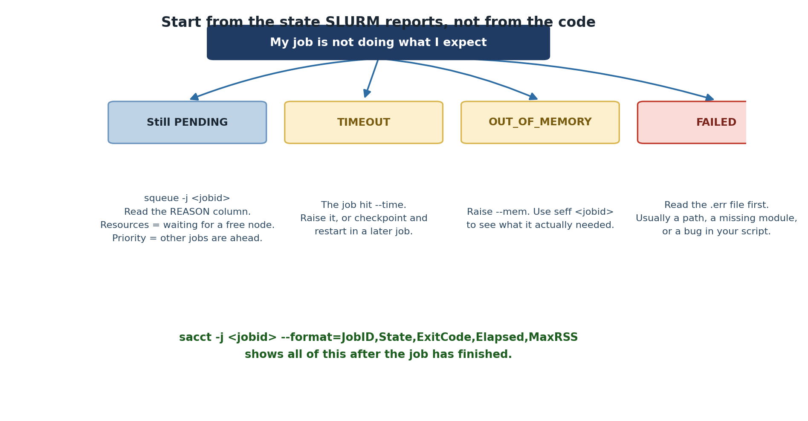

:::::::::::::::::::::::::::::::::::::: questions

- How do I monitor what my job is doing?
- How do I check the history of completed jobs?
- How efficient was my job? Did I waste resources?

::::::::::::::::::::::::::::::::::::::::::::::

::::::::::::::::::::::::::::::::::::: objectives

- Master `squeue` for real-time job status
- Use `sacct` to analyze completed job history
- Use `seff` to evaluate job efficiency
- Monitor node resources with `free`, `top`, and `nvidia-smi`

:::::::::::::::::::::::::::::::::::::::::::::::

## The Job Lifecycle

Every SLURM job moves through states:

```
SUBMITTED -> PENDING -> RUNNING -> COMPLETED/FAILED/CANCELLED
```

## Viewing Jobs with squeue

### Basic Usage

```bash
squeue -u $USER              # All your jobs
squeue -j 12345              # Specific job
squeue --states=RUNNING      # Only running jobs
squeue --states=PENDING      # Only pending jobs
```

{alt='Terminal on Sagehen HPC showing squeue output for one user. Three jobs named demo1, demo2, and demo3 run on the short partition in state R for 25 seconds each, on nodes a001 and a002.'}

### Useful Filters

```bash
# Jobs on a specific partition
squeue -p amd

# Custom output format
squeue -u $USER --format=jobid,name,state,elapsed,timelimit

# Watch in real-time (refreshes every 2 seconds)
watch -n 2 squeue -u $USER
```

{alt='A troubleshooting map starting from the statement that a job is not doing what you expect. Four branches: still PENDING, where squeue and the REASON column tell you whether it is waiting for resources or behind other jobs in priority; TIMEOUT, meaning the job hit its --time limit; OUT_OF_MEMORY, meaning --mem was too low and seff will show what it needed; and FAILED, where the error file is the place to start. A closing line gives the sacct command that reports all of these once the job has finished.'}

## Job History with sacct

After a job finishes, `squeue` no longer shows it. Use `sacct`:

```bash
# Recent completed jobs
sacct -u $USER

# Detailed format
sacct -u $USER --format=jobid,jobname,state,elapsed,exitcode,maxrss

# Failed jobs only
sacct -u $USER --state=FAILED

# Jobs from a specific date
sacct -u $USER --starttime=2026-03-04
```

{alt='Terminal output of sacct filtered to the last five minutes. Jobs 38366 through 38369 show state COMPLETED with exit code 0:0, while job 38370 named fail shows FAILED with exit code 1:0. Each job lists batch and extern steps with MaxRSS values.'}

### Understanding Exit Codes

- **0**: Success
- **1-127**: Error from your program
- **138**: Timeout (exceeded time limit)
- **143**: Cancelled by user or system

## Job Efficiency with seff

`seff` shows whether you wasted resources:

```bash
seff 12345
```

Output:
```
Job ID: 12345
State: COMPLETED (exit code 0)
Cores: 4
Job Wall-clock time: 01:22:45
  Percent of CPUs in use: 100.0%
Memory Requested: 16.00 GB
Memory Used: 2.34 GB
  Percent of Memory in use: 14.6%
```

**Interpreting**:
- CPU usage near 100% = good match
- CPU usage below 50% = request fewer cores next time
- Memory usage near 100% = request more next time
- Memory usage below 20% = request less next time

## Monitoring Nodes Directly

If you SSH to the compute node running your job:

```bash
ssh a005           # Connect to the node
free -h            # Memory usage
top                # CPU usage (press q to exit)
nvidia-smi         # GPU usage (on GPU nodes)
logout             # Return to head node
```

::::::::::::::::::::::::::::::::::::::: callout

## Disk Usage on BeeGFS

Use `quota_check.sh` to check storage usage on Sagehen HPC's BeeGFS filesystem. The standard `du` command does not work correctly for quota checks.

:::::::::::::::::::::::::::::::::::::::::::::::

::::::::::::::::::::::::::::::::::::: challenge

## Challenge 1: Monitor and Analyze a Job

1. Submit a test job:
   ```bash
   sbatch --cpus-per-task=2 --mem=4G --time=00:05:00 -p short --wrap="sleep 30; echo Done"
   ```
2. Monitor with: `watch -n 1 squeue -u $USER`
3. After completion, check history: `sacct -u $USER --format=jobid,state,exitcode | tail -5`
4. Analyze efficiency: `seff JOBID`

:::::::::::::::::::::::: solution

## Solution

The job runs for 30 seconds then completes. `sacct` shows STATE=COMPLETED with exit code 0:0. `seff` shows low efficiency because we requested 2 cores but `sleep` only uses 1 thread. Real compute jobs should have much better efficiency.

:::::::::::::::::::::::::::::::::::::
:::::::::::::::::::::::::::::::::::::

:::::::::::::::::::::::::::::::::::::::: keypoints

- Use `squeue` for real-time job status and `watch` for continuous monitoring
- Use `sacct` to view completed job history and exit codes
- Use `seff` to analyze resource efficiency and adjust future requests
- Exit code 0 = success, 138 = timeout, 143 = cancelled
- Monitor nodes with `free -h`, `top`, and `nvidia-smi`
- Use `quota_check.sh` for BeeGFS storage usage (not `du`)

::::::::::::::::::::::::::::::::::::::::::::::
